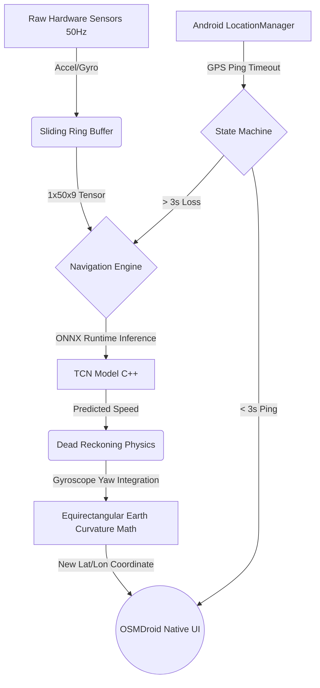

# 🚗 AI-ML based Intelligent Dead Reckoning System (SIH 26168)

> **A 100% Offline, Edge-AI Navigation Engine that seamlessly takes over when GPS fails in tunnels, forests, and underground areas.**

## 🚨 The Problem (SIH Problem Statement: 26168)
Modern navigation relies entirely on GNSS (GPS) satellites. When a vehicle enters a tunnel, dense forest, or underground parking, the satellite signal is physically blocked. Traditional navigation apps freeze or snap to incorrect roads. Standard physics-based dead reckoning (double integration of acceleration) fails within seconds due to **Quadratic Error Drift** caused by noisy smartphone sensors.

## 💡 Our Solution & Unique Selling Proposition (USP)
We built an autonomous **Edge-AI Architecture** that bypasses standard physics integration. 
Our solution detects a GPS blackout in real-time, instantly hot-swaps to a **Temporal Convolutional Network (TCN)** running on the smartphone's local CPU via **ONNX**, and predicts the vehicle's exact velocity from raw vibrations (Accelerometer/Gyroscope) without a single byte of internet.

### 🔥 Key Features
- **100% Offline Edge Computing:** The AI model is deployed via `onnxruntime-android`. Zero cloud APIs. Zero latency. Zero internet required during blackouts.
- **Defeating Quadratic Drift:** Our PyTorch TCN uses *Dilated Causal Convolutions* to process a 50Hz sliding window of sensor data, calculating speed via pattern recognition rather than mathematical integration.
- **Autonomous State Machine:** A background foreground service continuously monitors ping latency. Exactly at 3 seconds of GPS drop, it seamlessly swaps the map engine over to the AI, and snaps back when GPS returns.
- **Decentralized Mapping:** Bypasses Google Maps SDK entirely. Built using **OSMDroid** (OpenStreetMap) for true offline rendering, coupled with the **Photon API** for fuzzy-search routing localized to the Indian subcontinent.

## 🏗️ System Architecture

## 🛠️ Tech Stack
- **Frontend & App Backend:** Native Android (Kotlin), Material Design Components.
- **Machine Learning:** PyTorch, Pandas, NumPy, Scikit-learn (Trained on IO-VNBD dataset).
- **Edge Deployment:** ONNX (Open Neural Network Exchange), ONNX Runtime C++.
- **Maps & Routing:** OSMDroid, Photon API, OSRM (Open Source Routing Machine).

## 🚀 Installation & Testing

Want to test the AI Dead Reckoning yourself? 

1. **Download the APK:** [Click here to download the App Release](#) *(Coming Soon - Build the APK using the instructions below)*
2. **Install on Android:** Transfer the `app-debug.apk` to your phone and install it (Grant Location & Notification permissions on launch).
3. **How to Test Offline AI:**
   - Type a destination (e.g., "DTU Library") and hit **Get Directions**.
   - Hit **Start Route**.
   - Turn OFF your phone's Wi-Fi and Mobile Data.
   - Walk inside a building where the roof blocks the GPS.
   - Watch the UI instantly turn RED (`System Status: OFFLINE AI Dead Reckoning Active`) and notice the blue arrow continue to follow your physical movement using only the internal IMU sensors!

### 💻 How to Build from Source
If you are a developer and want to build the project locally:
1. Clone this repository: `git clone https://github.com/yugam-dtu/sih-project.git`
2. Open the `android_app` folder in **Android Studio**.
3. Let Gradle sync and download dependencies (`onnxruntime`, `osmdroid`).
4. Click **Build > Build Bundle(s) / APK(s) > Build APK(s)**.
5. The compiled APK will be output to `android_app/app/build/outputs/apk/debug/`.

---
*Built with ❤️ for Smart India Hackathon.*
